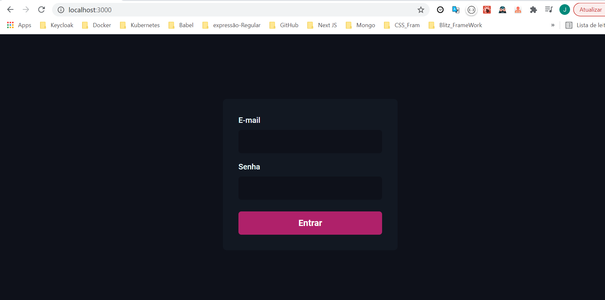
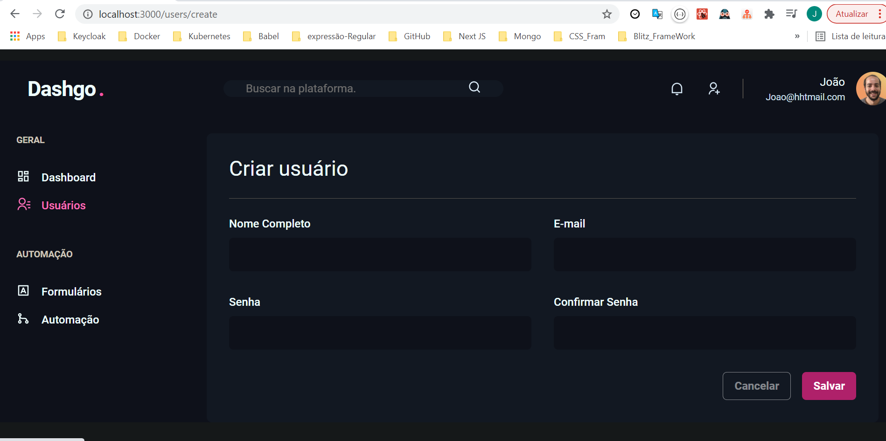

<p align="center"></p>

<h1 align="center">
# João Ferreira Neto - Aluno do IGNITE </h1>

  &nbsp;
  <h4 align="center"> 
	Modelo de autenticação, Chakra-ui, NEXTJs, Responsivo.
    -> Atenticação
    -> Dashbard
    -> Users
  </h4>
  
  <h1 align="center">
    <a href="https://pt-br.reactjs.org/">🔗 Next.Js</a>
  </h1>

<p align="center">:rocket:🚀  Projeto feito para conquetrizar o modulo Next.Js do IGNITE @Rocketseat</p>

<p align="center">
    ·
    <a href="README.md">Português</a>
 </p>

<div align="center">
  <sub>Construído com ❤︎ por
    <a href="https://github.com/joaofnetojfn">João Ferreira Neto</a> and
    <p>
     <a href="https://rocketseat.com.br/" target="_blank">
      contributors
    </a>
    </p>
  </sub>
</div>


# :pushpin: Tabela de Conteúdo

* [Tecnologias](#computer-tecnologias)
* [Funcionalidades](#rocket-funcionalidades)
* [Como rodar](#construction_worker-como-rodar)
* [Encontrou um bug? Ou está faltando uma feature?](#bug-problemas)
* [Contribuindo](#tada-contribuindo)
* [Licencia](#closed_book-licencia)

<h2 align="left"> 📥 Layout disponivel para download em: </h2>

### Web Screenshot
<div style="display: flex; flex-direction: 'row'; align-items: 'center';">
   
   
</div> 

# :computer: Tecnologias
Esse projeto foi feito utilizando as seguintes tecnologias:

* [Typescript](https://www.typescriptlang.org/)      
* [React](https://reactjs.org/) && [Next.Js](https://nextjs.org/docs/authentication)
* [Fauna](https://docs.fauna.com/fauna/current/start/index.html)
* [Stripe](https://stripe.com/docs/payments)

# :rocket: Funcionalidades

* Web Site com login e navegação de menu, dashbord, tela que lista usuarios.

# :construction_worker: Como rodar
```bash
# Clone o Repositoria
$ git clone https://github.com/joaofnetojfn/dashgo

### 💻 Rode o Project Web

```bash
# Vá para a pasta web
$ cd dashgo

# Instale as depedencias
$ yarn install

# Rode a aplicação
$ yarn dev

# Rode o teste 
$ yarn test
```
Acesse: http://localhost:3000/ para ver o resultado.

🚧  Status: 🚀 Em construção...  🚧<br/>
🚧  Status: 🚀 Em construção...  🚧<br/>
🚧  Status: 🚀 Em construção...  🚧<br/>

# :bug: Problemas

Fique a vontade **para criar uma nova issue** com o respectivo titulo e descrição na página de issues do [Desafio](https://github.com/joaofnetojfn/dashgo/issues) Repositorio. Se você já encontrou a solução para o problema, **Eu amaria fazer o review do seu pull request**!

# :tada: Contribuindo

🚧  Status: 🚀 Em construção...  🚧

# :closed_book: Licencia

Lançado em 2021 :closed_book: Licencia

Feito com amor por [JoãoFerreiraNeto](https://github.com/joaofnetojfn) 🚀.
Esse projeto esta sobre [MIT license] 🚧  Status:React Select 🚀 Em construção...  🚧 .


Dê uma ⭐️ se esse projeto te ajudou!

 <br/> :purple_heart: &nbsp; Buscando colaborar com desafios em:<br/>
  - Front-end usando React. <br/>
  - Back-end usando Nodejs. <br/> 
  - Banco de dados conhecimento em SQL e NoSQL.
  
  
 <br/> :blush: &nbsp; Posso te ajudar em melhorias de processo e criação de novos Projetos.
 <br/> :computer: &nbsp; Minha stack: ReactJS, Node.js, React Native & Typescript, onde venho estudando cada vez mais.
 <br/> 💬  &nbsp; Sobre mim: Uma pessoa curiosa sobre tecnologia e serviço em geral, onde toda aprendizado pode ser chavves para resoluções de problemas, apaixonado por jogos: Call of duty Mobile...., trilhas e trekking entre outros.
  <br/> :email: &nbsp; Entre em contato comigo: [](https://www.linkedin.com/in/joaoferreiraneto/)
[](mailto:joaofnetojfn@hotmail.com)


# Documentação do [`create-next-app`]

This is a [Next.js](https://nextjs.org/) project bootstrapped with [`create-next-app`](https://github.com/vercel/next.js/tree/canary/packages/create-next-app).

## Getting Started

First, run the development server:

```bash
npm run dev
# or
yarn dev
```


This is a [Next.js](https://nextjs.org/) project bootstrapped with [`create-next-app`](https://github.com/vercel/next.js/tree/canary/packages/create-next-app).

## Getting Started

First, run the development server:

```bash
npm run dev
# or
yarn dev
```

Open [http://localhost:3000](http://localhost:3000) with your browser to see the result.

You can start editing the page by modifying `pages/index.js`. The page auto-updates as you edit the file.

[API routes](https://nextjs.org/docs/api-routes/introduction) can be accessed on [http://localhost:3000/api/hello](http://localhost:3000/api/hello). This endpoint can be edited in `pages/api/hello.js`.

The `pages/api` directory is mapped to `/api/*`. Files in this directory are treated as [API routes](https://nextjs.org/docs/api-routes/introduction) instead of React pages.

## Learn More

To learn more about Next.js, take a look at the following resources:

- [Next.js Documentation](https://nextjs.org/docs) - learn about Next.js features and API.
- [Learn Next.js](https://nextjs.org/learn) - an interactive Next.js tutorial.

You can check out [the Next.js GitHub repository](https://github.com/vercel/next.js/) - your feedback and contributions are welcome!

## Deploy on Vercel

The easiest way to deploy your Next.js app is to use the [Vercel Platform](https://vercel.com/new?utm_medium=default-template&filter=next.js&utm_source=create-next-app&utm_campaign=create-next-app-readme) from the creators of Next.js.

Check out our [Next.js deployment documentation](https://nextjs.org/docs/deployment) for more details.
